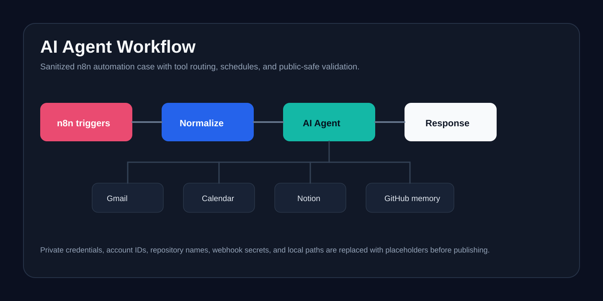

# AI Agent Workflow

<p>
  <a href="https://github.com/bpnace/AI-Agent-Workflow/actions/workflows/ci.yml">
    
  </a>
  
  
  
  
  
  
  
  
</p>



Sanitized n8n workflow for a personal AI operations agent.

This repo is a public, recruiter-friendly version of a real automation workflow. It keeps the architecture and implementation shape visible while removing private credentials, personal account IDs, private repository names, webhook secrets, and local paths.

## Case study

### Problem
A real personal automation agent is useful as a portfolio case only if the
implementation shape stays visible and private accounts, memory paths,
credentials, and webhook details are removed completely.

### Solution
I turned the private workflow into a public-safe n8n export with placeholder
credentials, clear import instructions, GitHub-backed memory framing, and a
validation script that fails on leaked secret-like values.

### Engineering decisions
- Keep one importable workflow rather than fragmenting the showcase into partial exports
- Preserve the agent routing shape across Telegram, chat, schedules, and tools
- Replace private identifiers with explicit placeholders
- Add a validation script as the publish gate
- Document reconnect steps instead of committing live credential references

### Outcome
The repo works as an AI automation case study: it shows practical agent design,
tool orchestration, public-safe hygiene, and automation verification without
exposing private infrastructure.

## What this shows

- Telegram and n8n chat input for a personal assistant workflow
- Voice transcription and photo analysis branches
- AI agent loop with tool routing
- Gmail search/read/draft actions
- Google Calendar read/create actions
- Notion CRM search/read/create/update actions
- GitHub-backed markdown memory as a portable memory store
- Scheduled morning, pre-meeting, midday, evening, and weekly heartbeat prompts
- Validation script that blocks leaked credentials before publishing

## Workflow shape

```text
Telegram / Chat / Schedule
        |
Normalize input and route by source
        |
AI Agent
        |
Tool router
        |
Gmail | Calendar | Notion | GitHub memory
        |
Final response back to chat or Telegram
```

## Repo structure

```text
workflows/ai-agent-workflow.sanitized.json  Sanitized n8n export
scripts/validate-workflow.mjs              JSON and secret-leak validation
.env.example                               Example environment variables
SECURITY.md                                Handling rules for secrets
```

## Import

1. Import `workflows/ai-agent-workflow.sanitized.json` into n8n.
2. Reconnect credentials for Telegram, OpenAI, DeepSeek, Gmail, Google Calendar, Notion, and GitHub.
3. Replace placeholder values such as `YOUR_TELEGRAM_CHAT_ID`, `YOUR_GITHUB_USER/YOUR_MEMORY_REPO`, `work@example.com`, and `personal@example.com`.
4. Run a dry test with chat input before enabling schedules or Telegram triggers.

## Validate before publishing

```bash
npm test
```

The validator fails if the workflow contains n8n credential references, private identifiers from the original workflow, common token formats, or real secret-like values.

## Notes

This is a showcase workflow, not a drop-in production bundle. The original private deployment used real credentials and personal memory paths. Those have intentionally been replaced with placeholders.
